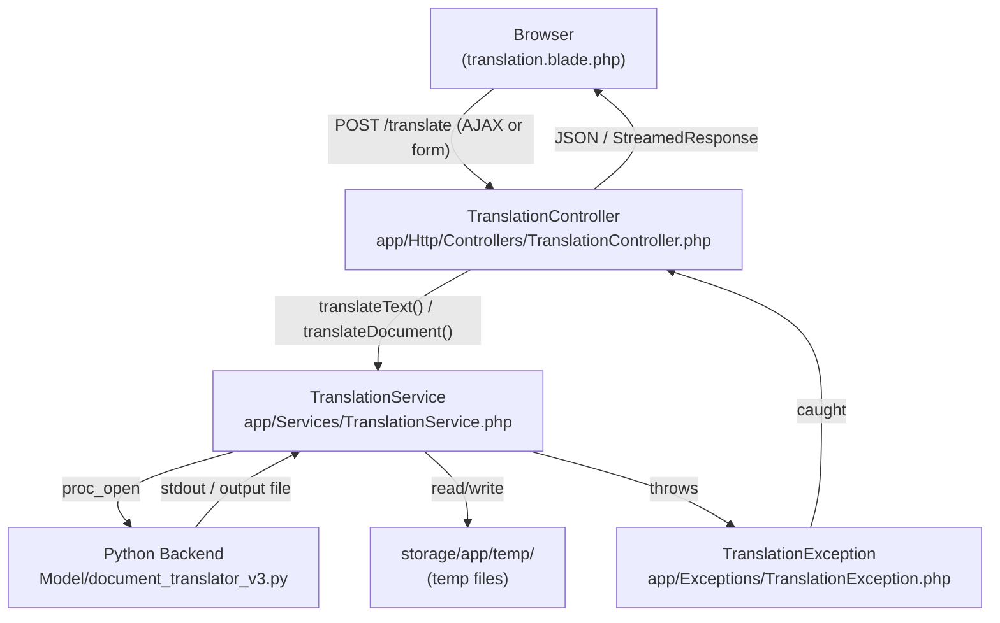

# Design Document — New Translation Page

## Overview

The New Translation page is the primary feature of the TriLingua application. It gives authenticated users a single, focused interface for translating text or documents between English, Cebuano, and Filipino using the existing Python NLLB-200 backend.

The page lives at `/translate`, is protected by the `auth` middleware, and integrates into the existing sidebar layout without changing the application shell. The design follows the established TriLingua patterns: a `TranslationController` handles HTTP concerns, a `TranslationService` encapsulates subprocess invocation, and a dedicated Blade view + per-view CSS file handle the UI.

### Key Design Decisions

- **AJAX for text, full-page redirect for documents.** Text translation returns `{ translated: "..." }` as JSON so the output panel updates without a page reload. Document translation returns a streamed file download, which requires a full form submission.
- **Subprocess via `proc_open`.** The Python script is long-running (seconds to minutes). `proc_open` gives fine-grained control over stdin/stdout/stderr and lets us enforce the 60-second timeout with `stream_set_timeout`.
- **Temp files in `storage/app/temp`.** All intermediate files (input text file, output translated file) are written here and deleted via `register_shutdown_function` so cleanup happens even on fatal errors.
- **No new JS framework.** All frontend logic is vanilla JS in an inline `<script>` tag, consistent with `settings.blade.php`.
- **No database changes.** This feature does not persist translations; it is a stateless request/response flow.

---

## Architecture

```
Browser
  │
  │  GET /translate
  ▼
TranslationController::show()
  └─► returns view('translation')

  │  POST /translate  (text — AJAX)
  ▼
TranslationController::translate()
  ├─ validate(source_lang, target_lang, text)
  ├─ TranslationService::translateText(text, src, tgt)
  │     └─ writes temp .txt → proc_open python → reads output → deletes temps
  └─ return JSON { translated: "..." }

  │  POST /translate  (document — multipart form)
  ▼
TranslationController::translate()
  ├─ validate(source_lang, target_lang, document)
  ├─ TranslationService::translateDocument(file, src, tgt)
  │     └─ stores upload → proc_open python → returns output path
  └─ return StreamedResponse (download) + register_shutdown_function(delete temps)
```

### Component Diagram



---

## Components and Interfaces

### 1. Routes (`routes/web.php`)

Two new routes added inside the existing `auth` + `throttle:60,1` middleware group:

```php
Route::get('/translate',  [TranslationController::class, 'show'])->name('translate');
Route::post('/translate', [TranslationController::class, 'translate'])->name('translate.submit');
```

### 2. TranslationController (`app/Http/Controllers/TranslationController.php`)

```php
namespace App\Http\Controllers;

use App\Exceptions\TranslationException;
use App\Services\TranslationService;
use Illuminate\Contracts\View\View;
use Illuminate\Http\JsonResponse;
use Illuminate\Http\Request;
use Symfony\Component\HttpFoundation\StreamedResponse;

class TranslationController extends Controller
{
    public function __construct(private TranslationService $service) {}

    /** GET /translate — render the page */
    public function show(): View

    /** POST /translate — handle text or document translation */
    public function translate(Request $request): JsonResponse|StreamedResponse
}
```

**Validation rules (text mode):**
- `source_lang`: required, in:English,Cebuano,Filipino
- `target_lang`: required, in:English,Cebuano,Filipino, different from `source_lang`
- `text`: required_without:document, string, max:8000

**Validation rules (document mode):**
- `source_lang`: required, in:English,Cebuano,Filipino
- `target_lang`: required, in:English,Cebuano,Filipino, different from `source_lang`
- `document`: required_without:text, file, mimes:docx,pdf,txt,md,rtf,odt,csv, max:10240 (KB)

**Response contract:**
- Text success → `200 application/json` `{ "translated": "..." }`
- Document success → `200 application/octet-stream` streamed download
- Validation error → `422 application/json` `{ "errors": { "field": ["message"] } }`
- Translation error → `500 application/json` `{ "error": "..." }`
- Timeout → `504 application/json` `{ "error": "Translation timed out after 60 seconds." }`

### 3. TranslationService (`app/Services/TranslationService.php`)

```php
namespace App\Services;

use App\Exceptions\TranslationException;
use Illuminate\Http\UploadedFile;

class TranslationService
{
    private const LANGUAGE_MAP = [
        'English'  => 'eng_Latn',
        'Cebuano'  => 'ceb_Latn',
        'Filipino' => 'tgl_Latn',
    ];

    private const EXTENSION_MAP = [
        '.docx' => '.docx',
        '.pdf'  => '.pdf',
        '.txt'  => '.txt',
        '.md'   => '.md',
        '.csv'  => '.csv',
        '.rtf'  => '.docx',
        '.odt'  => '.docx',
    ];

    private const TIMEOUT_SECONDS = 60;

    /**
     * Translate a plain-text string.
     *
     * @throws TranslationException
     */
    public function translateText(string $text, string $sourceLang, string $targetLang): string

    /**
     * Translate an uploaded document file.
     * Returns the absolute path to the translated output file.
     *
     * @throws TranslationException
     */
    public function translateDocument(UploadedFile $file, string $sourceLang, string $targetLang): string
}
```

**`translateText` implementation steps:**
1. Write `$text` to `storage/app/temp/{uuid}.txt`
2. Determine output path: `storage/app/temp/{uuid}_out.txt`
3. Build command: `python Model/document_translator_v3.py {input} {src_code} {tgt_code} {output}`
4. Open process with `proc_open`, set stream timeout to 60 s
5. Read stderr; if exit code ≠ 0 → throw `TranslationException($stderr)`
6. Read output file content → return as string
7. Delete both temp files (also registered in shutdown function)

**`translateDocument` implementation steps:**
1. Store uploaded file to `storage/app/temp/{uuid}{ext}`
2. Determine output extension via `EXTENSION_MAP`
3. Determine output path: `storage/app/temp/{uuid}_translated{out_ext}`
4. Build and run command (same as above)
5. If exit code ≠ 0 → throw `TranslationException($stderr)`
6. Return output file path (caller streams it; shutdown function deletes both)

**Python invocation command:**

The Python script (`document_translator_v3.py`) is designed as a Colab notebook and does not have a CLI entry point. The service will invoke it by calling the `run_pipeline` function. Since the script cannot be called directly as a CLI tool, the service will use a small Python one-liner wrapper:

```
python -c "
import sys; sys.path.insert(0, 'Model');
from document_translator_v3 import run_pipeline;
run_pipeline(sys.argv[1], sys.argv[2], sys.argv[3], sys.argv[4])
" {input_file} {source_lang_name} {target_lang_name} {output_file}
```

Language names are passed as human-readable strings (e.g. `"English"`) because the Python script's `LANGUAGES` dict maps them internally.

### 4. TranslationException (`app/Exceptions/TranslationException.php`)

```php
namespace App\Exceptions;

use RuntimeException;

class TranslationException extends RuntimeException {}
```

A thin wrapper around `RuntimeException`. The message is the stderr output from the Python process.

### 5. Blade View (`resources/views/translation.blade.php`)

Extends `layouts/app.blade.php`. Sections:
- `@section('title', 'New Translation')`
- `@section('styles')` — loads `resources/css/views/translation.css` via `@vite`
- `@section('content')` — the two-panel layout

**HTML structure (BEM-lite class names):**

```
.translation-layout
  .translation-panel.translation-panel--source
    .translation-panel__header
      select#source-lang
      .translation-swap  (swap button)
      select#target-lang
    .translation-panel__body
      textarea#source-text
      .translation-panel__file-info  (hidden by default)
        span#file-name
        button#remove-file
      .translation-panel__footer
        button#attach-btn  (triggers hidden file input)
        input#file-input[type=file][hidden]
        span#char-counter
    .translation-panel__error  (inline error area)
  .translation-panel.translation-panel--output
    .translation-panel__header
      span (label: "Translation")
    .translation-panel__body
      div#output-text  (read-only display area)
      div#output-download  (hidden; shown for document results)
        a#download-link
    .translation-panel__footer
      button#copy-btn[aria-disabled=true]
      button#save-btn[aria-disabled=true]
    .translation-panel__error  (inline error area)
  .translation-actions
    button#translate-btn.btn.primary
```

**Note on layout:** The swap button and both language selectors share the same header row. On mobile (≤ 768 px) the panels stack vertically and the swap button becomes a down-arrow icon.

### 6. CSS (`resources/css/views/translation.css`)

Uses only `--bg`, `--card-bg`, `--text`, `--muted`, `--primary`, `--accent`, `--border`, `--radius` from `base.css`. BEM-lite naming. Responsive breakpoint at `max-width: 768px` (same as `settings.css`).

Key rules:
- `.translation-layout` — `display: flex; gap: 24px; align-items: flex-start`
- `.translation-panel` — `flex: 1; min-width: 280px; background: var(--card-bg); border-radius: var(--radius)`
- `.translation-panel__body textarea` — `width: 100%; resize: none; min-height: 240px`
- `.counter-warning` — `color: var(--accent)` (uses the existing red accent)
- `@media (max-width: 768px)` — `.translation-layout { flex-direction: column }`

### 7. Vite Config (`vite.config.js`)

Add `'resources/css/views/translation.css'` to the `input` array.

### 8. Layout Update (`resources/views/layouts/app.blade.php`)

Change:
```html
<a href="#" class="nav-link">New Translation</a>
```
To:
```html
<a href="{{ route('translate') }}" class="nav-link {{ request()->routeIs('translate') ? 'active' : '' }}">New Translation</a>
```

---

## Data Models

No new database tables or Eloquent models are required. All translation state is transient (request/response cycle).

### Temp File Lifecycle

| Stage | Path | Created by | Deleted by |
|---|---|---|---|
| Text input | `storage/app/temp/{uuid}.txt` | `TranslationService::translateText` | Shutdown function |
| Text output | `storage/app/temp/{uuid}_out.txt` | Python backend | Shutdown function |
| Document input | `storage/app/temp/{uuid}{ext}` | `TranslationService::translateDocument` | Shutdown function |
| Document output | `storage/app/temp/{uuid}_translated{out_ext}` | Python backend | Shutdown function |

### Request Payload Shapes

**Text translation (AJAX):**
```json
{
  "source_lang": "English",
  "target_lang": "Cebuano",
  "text": "Hello world"
}
```

**Document translation (multipart/form-data):**
```
source_lang=English
target_lang=Cebuano
document=<file>
```

### Response Shapes

**Text success:**
```json
{ "translated": "Kumusta kalibutan" }
```

**Validation error:**
```json
{
  "message": "The source lang and target lang must be different.",
  "errors": {
    "target_lang": ["The source lang and target lang must be different."]
  }
}
```

**Translation error:**
```json
{ "error": "Python backend error: <stderr output>" }
```

---

## Correctness Properties

*A property is a characteristic or behavior that should hold true across all valid executions of a system — essentially, a formal statement about what the system should do. Properties serve as the bridge between human-readable specifications and machine-verifiable correctness guarantees.*

### Property 1: Language swap exchanges values

*For any* two distinct language values (source, target), activating the Swap_Button should result in the source selector holding the old target value and the target selector holding the old source value.

**Validates: Requirements 2.4**

---

### Property 2: Same-language swap is rejected

*For any* language value L, if the source and target selectors both hold L, activating the Swap_Button should not exchange the values and should display an inline error message.

**Validates: Requirements 2.6**

---

### Property 3: Same-language POST is rejected by the controller

*For any* language value L in {English, Cebuano, Filipino}, a POST to `/translate` with `source_lang == target_lang == L` should return a validation error without invoking the Translation_Service.

**Validates: Requirements 2.7, 7.6**

---

### Property 4: Character counter reflects input length

*For any* text of length N (0 ≤ N ≤ 8000) entered into the source textarea, the Character_Counter element should display the string `"N/8000"`.

**Validates: Requirements 3.2**

---

### Property 5: Input is capped at 8000 characters

*For any* text of length greater than 8000 characters pasted into the source textarea, the textarea value after the input event should have length exactly 8000.

**Validates: Requirements 3.4, 3.5**

---

### Property 6: Counter warning class tracks the 7500 threshold

*For any* text of length N entered into the source textarea, the `counter-warning` CSS class should be present on the Character_Counter element if and only if N > 7500.

**Validates: Requirements 3.6, 3.7**

---

### Property 7: Unsupported file extensions are rejected client-side

*For any* file whose extension is not in {.docx, .pdf, .txt, .md, .rtf, .odt, .csv}, the client-side file validation should reject it and display an inline error message without submitting the form.

**Validates: Requirements 4.5**

---

### Property 8: Oversized files are rejected client-side

*For any* file whose size exceeds 10,485,760 bytes, the client-side file validation should reject it and display an inline error message without submitting the form.

**Validates: Requirements 4.6**

---

### Property 9: Language name maps to correct NLLB code

*For any* language name in {English, Cebuano, Filipino}, the Translation_Service's internal mapping should return the corresponding NLLB code: `eng_Latn`, `ceb_Latn`, or `tgl_Latn` respectively.

**Validates: Requirements 7.2**

---

### Property 10: Non-zero exit code throws TranslationException with stderr

*For any* stderr string S and any non-zero exit code, when the Python subprocess exits with that code, the Translation_Service should throw a `TranslationException` whose message equals S.

**Validates: Requirements 7.5**

---

### Property 11: Output file extension follows the defined mapping

*For any* input file with extension E in {.docx, .pdf, .txt, .md, .csv, .rtf, .odt}, the Translation_Service should produce an output file whose extension matches the defined mapping (.rtf → .docx, .odt → .docx, all others → same extension).

**Validates: Requirements 7.4**

---

### Property 12: Controller rejects text outside valid length range

*For any* text of length 0 or length greater than 8000, a POST to `/translate` with that text should return a validation error without invoking the Translation_Service.

**Validates: Requirements 7.7**

---

### Property 13: Controller rejects invalid file uploads

*For any* file with an unsupported extension or a size exceeding 10,485,760 bytes, a POST to `/translate` with that file should return a validation error without invoking the Translation_Service.

**Validates: Requirements 7.8**

---

### Property 14: Temp files are deleted after response

*For any* translation request (text or document, success or failure), after the HTTP response is sent, neither the input temp file nor the output temp file should exist in `storage/app/temp`.

**Validates: Requirements 7.9**

---

### Property 15: Save filename matches timestamp pattern

*For any* UTC timestamp at the moment the Save button is activated, the downloaded filename should match the pattern `translation_YYYYMMDD_HHMMSS.txt`.

**Validates: Requirements 6.4**

---

## Error Handling

### Validation Errors (422)

Laravel's built-in validation handles all input errors. The controller uses `$request->validate([...])` which automatically returns a 422 JSON response for AJAX requests. The frontend reads `response.errors` and renders messages inline.

Error display locations:
- Same-language error → adjacent to the language selectors in `.translation-panel__error`
- Empty input error → in `.translation-panel__error` of the source panel
- File type/size error → in `.translation-panel__error` of the source panel

### Translation Errors (500)

`TranslationException` is caught in `TranslationController::translate()`. The controller returns:
```json
{ "error": "Translation failed: <message>" }
```
The frontend renders this in the output panel's error area.

### Timeout (504)

The service uses `stream_set_timeout` on the process pipes. If the process exceeds 60 seconds, the service kills the process and throws `TranslationException("Translation timed out after 60 seconds.")`. The controller returns a 504 response.

### Clipboard API Failure

The frontend wraps `navigator.clipboard.writeText()` in a try/catch. On failure, it renders an inline error in the output panel's error area without clearing the translated text.

### File Cleanup on Failure

`register_shutdown_function` is used to delete temp files. This runs even if the PHP process dies mid-request, ensuring no orphaned files accumulate in `storage/app/temp`.

---

## Testing Strategy

### Unit Tests (PHPUnit)

Focus on specific examples, edge cases, and error conditions:

- `TranslationServiceTest`
  - `test_translate_text_returns_translated_string` — mock subprocess, verify return value
  - `test_translate_text_throws_on_nonzero_exit` — mock subprocess with exit code 1, verify exception
  - `test_translate_document_returns_output_path` — mock subprocess, verify path returned
  - `test_translate_document_maps_rtf_to_docx` — verify extension mapping for .rtf
  - `test_translate_document_maps_odt_to_docx` — verify extension mapping for .odt
  - `test_language_map_returns_correct_nllb_codes` — verify all three mappings

- `TranslationControllerTest`
  - `test_show_requires_authentication` — GET /translate without auth → 302 to /login
  - `test_show_returns_translation_view` — GET /translate as auth user → 200
  - `test_translate_rejects_same_language` — POST with source == target → 422
  - `test_translate_rejects_empty_text` — POST with empty text → 422
  - `test_translate_rejects_text_over_8000_chars` — POST with 8001-char text → 422
  - `test_translate_rejects_unsupported_file_extension` — POST with .xyz file → 422
  - `test_translate_rejects_file_over_10mb` — POST with oversized file → 422
  - `test_translate_text_returns_json` — POST valid text → 200 JSON
  - `test_translate_document_returns_download` — POST valid file → streamed response
  - `test_translate_returns_error_on_translation_exception` — service throws → 500 JSON

### Property-Based Tests (PHPUnit + eris or similar)

The project uses PHPUnit. For property-based testing, use the [**eris**](https://github.com/giorgiosironi/eris) library (PHP property-based testing library for PHPUnit).

Each property test runs a minimum of **100 iterations**.

Tag format: `// Feature: new-translation-page, Property {N}: {property_text}`

- **Property 3** — `TranslationControllerPropertyTest::test_same_language_always_rejected`
  Generate random language value L from {English, Cebuano, Filipino}; POST with source_lang == target_lang == L; assert 422 response every time.

- **Property 9** — `TranslationServicePropertyTest::test_language_name_maps_to_nllb_code`
  Generate random language name from {English, Cebuano, Filipino}; assert the mapping returns the correct NLLB code.

- **Property 10** — `TranslationServicePropertyTest::test_nonzero_exit_throws_translation_exception`
  Generate random stderr string and random non-zero exit code; mock subprocess; assert TranslationException thrown with that stderr message.

- **Property 11** — `TranslationServicePropertyTest::test_output_extension_follows_mapping`
  Generate random input extension from Supported_Formats; assert output extension matches the defined mapping.

- **Property 12** — `TranslationControllerPropertyTest::test_text_length_validation`
  Generate random text of length 0 or > 8000; POST to /translate; assert 422 response every time.

- **Property 13** — `TranslationControllerPropertyTest::test_invalid_file_rejected`
  Generate random unsupported extension or random file size > 10MB; POST to /translate; assert 422 response every time.

- **Property 14** — `TranslationServicePropertyTest::test_temp_files_deleted_after_translation`
  Generate random text and language pair; run translation (with mocked subprocess); assert temp files do not exist after response.

### Frontend Tests (Vanilla JS — manual or Playwright)

The inline JS is tested manually or with Playwright end-to-end tests:
- Swap button exchanges select values
- Character counter updates on input
- Paste truncation at 8000 characters
- Counter warning class at 7500 threshold
- File type/size validation before submit
- Copy button label change
- Save button filename format

### Integration Tests

- Start the dev server, POST a real translation request with a short text string, verify the translated output is non-empty and in the target language.
- Verify that `storage/app/temp` is empty after a completed translation request.
