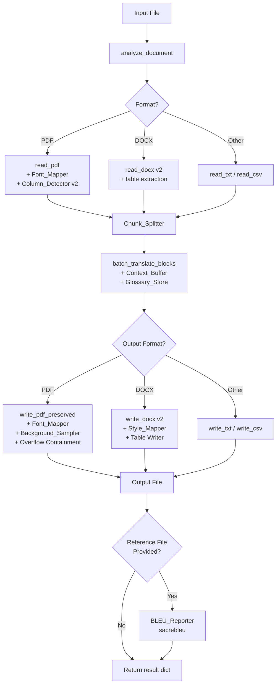

# Design Document: Translation Layout Quality

## Overview

This feature improves the Trilingua document translation pipeline across two dimensions: **translation quality** and **document layout fidelity**. The system uses `facebook/nllb-200-distilled-600M` for English ↔ Cebuano ↔ Filipino translation and reconstructs translated documents as PDF or DOCX files.

The improvements are implemented as nine focused components added to or replacing logic in `Model/document_translator_v3.py`, with no changes to `server.py` or the Laravel application layer. All components are pure Python and integrate into the existing `run_pipeline()` function.

### Goals

- Eliminate mid-sentence chunk splits that produce grammatically broken output
- Improve cross-block coherence via a sliding context window
- Enforce domain-specific terminology consistency via a user-supplied glossary
- Match original PDF fonts instead of always falling back to Helvetica
- Erase text regions using the actual background color instead of white
- Contain translated text overflow without colliding with adjacent blocks
- Preserve DOCX paragraph styles, alignment, spacing, and run colors
- Translate and reconstruct DOCX tables with full structural fidelity
- Report corpus-level BLEU scores for quality monitoring
- Detect 1–3 column layouts and full-width blocks for correct reading order

---

## Architecture

The pipeline remains a linear read → translate → write flow. The new components slot into existing phases without changing the public API of `run_pipeline()`.



### Key Design Decisions

1. **In-place augmentation over rewrite**: All new components are added to `document_translator_v3.py` as new classes/functions. The existing `run_pipeline()` signature is preserved; new optional parameters (`glossary`, `reference_file`) are added with `None` defaults so existing callers are unaffected.

2. **Chunk_Splitter replaces `_split_long_text`**: The existing `_split_long_text` function splits on sentence boundaries but does not enforce the 5-token minimum, the 150-token hard cap, or the content-preservation guarantee. `Chunk_Splitter` replaces it entirely.

3. **Context_Buffer is session-scoped**: The buffer is created once per `run_pipeline()` call and passed into `batch_translate_blocks()`. It is not persisted between jobs.

4. **Font metadata stored in block style dict**: `read_pdf()` already populates `block["style"]["font"]` with `"helv"`. `Font_Mapper` replaces this with the actual font name extracted from span metadata, so no second PDF parse is needed at write time.

5. **Background_Sampler uses PyMuPDF pixmap**: PyMuPDF's `page.get_pixmap()` renders the page to a pixel buffer. Corner sampling is done by reading pixel values from this buffer — no external image library required.

6. **DOCX table blocks use a distinct type**: Table cells are stored as `{"type": "table_cell", ...}` blocks alongside paragraph blocks. `reconstruct_document()` groups them back into tables before writing.

---

## Components and Interfaces

### 1. Chunk_Splitter

Replaces `_split_long_text`. Splits a block's text into sentence-boundary-aligned chunks.

```python
class Chunk_Splitter:
    SENTENCE_END = re.compile(r'(?<=[.!?])(?=\s|$)')

    def split(self, text: str, max_tokens: int = 80, hard_cap: int = 150,
              min_tokens: int = 5) -> list[str]:
        """
        Split `text` into chunks where:
        - Each chunk ends at a sentence boundary (. ! ?)
        - Preferred max is `max_tokens` words
        - Hard cap is `hard_cap` words per chunk
        - Minimum chunk size is `min_tokens` words
        - If no sentence boundary exists anywhere, return [text]
        - Content is fully preserved across all chunks
        Returns list of chunk strings.
        """
```

**Integration point**: Called inside `_translate_single()` before encoding, replacing the existing `_split_long_text()` call.

---

### 2. Context_Buffer

Maintains a sliding window of the last N translated blocks for use as a context hint.

```python
class Context_Buffer:
    def __init__(self, window_size: int = 2):
        self._buffer: deque[str] = deque(maxlen=window_size)

    def push(self, translated_text: str) -> None:
        """Add a newly translated block to the buffer."""

    def get_hint(self) -> str:
        """Return buffer contents joined by ' ||| ', or '' if empty."""

    def clear(self) -> None:
        """Reset the buffer (called at the start of each document job)."""
```

**Integration point**: Instantiated once in `run_pipeline()`, passed to `batch_translate_blocks()`. Inside `_translate_single()`, the hint is prepended to the source text with `" ||| "` as delimiter. Token budget enforcement (400-token cap) is applied before encoding.

---

### 3. Glossary_Store

Holds source→target term pairs and applies post-translation substitution.

```python
class Glossary_Store:
    def __init__(self, pairs: list[tuple[str, str]] | None = None):
        """
        pairs: list of (source_term, target_term).
        Raises ValueError if duplicates exist (case-insensitive source key).
        Raises ValueError if len(pairs) > 1000.
        """

    def apply(self, text: str) -> str:
        """
        Replace whole-word occurrences of each source term in `text`
        with the corresponding target term, preserving capitalisation.
        Returns the substituted text.
        """

    @staticmethod
    def _match_case(original_token: str, target_term: str) -> str:
        """Apply capitalisation pattern of original_token to target_term."""
```

**Capitalisation rules**: all-caps → `target.upper()`, title-case → `target.title()`, lowercase → `target.lower()`, other → use stored target as-is.

**Integration point**: Instantiated in `run_pipeline()` from the optional `glossary` parameter. `apply()` is called on each translated block text after `_translate_single()` returns, inside `batch_translate_blocks()`.

---

### 4. Font_Mapper

Maps PDF font names to usable fonts for `insert_textbox()`.

```python
class Font_Mapper:
    SANS_SERIF_KEYWORDS = {"arial", "helvetica", "calibri", "verdana", "tahoma",
                           "gothic", "sans"}
    SERIF_KEYWORDS      = {"times", "georgia", "garamond", "palatino", "roman",
                           "serif", "minion"}
    MONO_KEYWORDS       = {"courier", "mono", "consolas", "menlo", "inconsolata"}

    def resolve(self, font_name: str, embedded_fonts: set[str]) -> str:
        """
        Returns the fontname string to pass to insert_textbox():
        1. If font_name (case-insensitive) is in embedded_fonts → return font_name
        2. Else classify by keyword → return 'helv', 'tiro', or 'cour'
        3. On any failure → return 'helv' and log a warning
        """
```

**Integration point**: `read_pdf()` is updated to store `block["style"]["font"]` with the actual dominant span font name (from `span["font"]`). `write_pdf_preserved()` calls `Font_Mapper.resolve()` per block, passing the set of font names embedded in the original PDF (obtained via `fitz.Document.get_page_fonts()`).

---

### 5. Background_Sampler

Samples the pixel color at the four corners of a block's bounding box.

```python
class Background_Sampler:
    def sample(self, page: fitz.Page, bbox: tuple[float,float,float,float]
               ) -> tuple[float,float,float] | None:
        """
        Render the page to a pixmap and sample the four corners of bbox.
        - Clamps coordinates to page bounds before sampling.
        - Returns (r, g, b) floats in [0,1] if all four corners match.
        - Returns None if corners differ (non-uniform background).
        - Returns None if bbox has zero width or height.
        - Returns None and logs a warning if an exception occurs.
        """
```

**Integration point**: Called in `write_pdf_preserved()` before drawing the erase rectangle. If `sample()` returns a color tuple, that color is used as the fill. If it returns `None`, the clip-and-redraw strategy is used.

---

### 6. PDF_Writer Overflow Containment

Replaces the existing overflow handling in `write_pdf_preserved()`.

**Algorithm** (per overflowing block):
1. Call `insert_textbox()` with original rect. If `remaining >= 0`, done.
2. Check if expanding downward by `abs(remaining) + font_size` would bring the bottom within 2pt of any other block on the page.
3. If no collision: expand rect and re-insert.
4. If collision: reduce `font_size` by 1pt and retry from step 1. Repeat until `font_size == 6`.
5. If still overflowing at 6pt: insert remaining text in a continuation box of the same width, placed 4pt below the last block on the page.
6. If continuation box extends beyond page bottom: clip to page boundary and log a warning.

**Key constraint**: Steps 2–6 only modify the current block's rect and font size. All other blocks on the page are read-only during this process.

---

### 7. Style_Mapper

Maps DOCX paragraph style names from source to output document.

```python
class Style_Mapper:
    def resolve(self, style_name: str | None,
                available_styles: set[str]) -> str:
        """
        Returns the style name to apply to the output paragraph:
        - If style_name is in available_styles → return style_name
        - If style_name is None, empty, or not in available_styles → return 'Normal'
        """
```

**Integration point**: Used inside the updated `write_docx()`. The set of available styles is obtained from `output_doc.styles` at the start of the write phase.

---

### 8. Updated read_docx / write_docx (DOCX_Writer v2)

**read_docx v2** extracts:
- Paragraph style name (`para.style.name`)
- Alignment (`para.alignment`)
- Spacing (`para.paragraph_format.space_before`, `space_after`)
- Run-level font color (`run.font.color.rgb` if set)
- All tables: row/column structure, merge spans, cell text, run bold/font_size

Table cells are stored as:
```python
{
    "type": "table_cell",
    "text": str,
    "table_index": int,   # position of table in document body
    "row": int,
    "col": int,
    "row_span": int,
    "col_span": int,
    "style": {"bold": bool | None, "font_size": Pt | None}
}
```

**write_docx v2** reconstructs:
- Paragraphs with style, alignment, spacing, and run color applied
- Tables at the correct body position index, with merged cells and run formatting

---

### 9. BLEU_Reporter

Computes corpus-level BLEU after translation completes.

```python
class BLEU_Reporter:
    def compute(self, translated_blocks: list[dict],
                reference_file: str) -> float | None:
        """
        Reads reference_file (one block per non-empty line).
        Aligns by index up to min(len(translated_blocks), len(ref_lines)).
        Logs a warning if counts differ.
        Returns sacrebleu corpus BLEU score (0.0–100.0), or None on error.
        """
```

**Integration point**: Called at the end of `run_pipeline()` if `reference_file` is not `None`. The return value of `run_pipeline()` is changed from `(output_file, translated_blocks)` to a dict: `{"output_file": ..., "translated_blocks": ..., "bleu_score": float | None}`.

---

### 10. Column_Detector v2

Replaces `_detect_columns()` with gap-analysis-based multi-column detection.

```python
def detect_columns(blocks: list[dict], page_width: float
                   ) -> list[list[dict]]:
    """
    Returns a list of column groups (each group is a list of blocks),
    ordered left-to-right.
    - Uses x-coordinate gap analysis: gap >= 10% of page_width → column boundary
    - Supports 1, 2, or 3 columns
    - Full-width blocks (width >= 90% of page_width) are extracted first and
      interleaved with columnar blocks by y-coordinate
    - Falls back to single-column (all blocks sorted by y) if < 2 blocks per
      candidate column
    """
```

**Integration point**: Replaces the `_detect_columns()` call in `read_pdf()`. The final block list is assembled by merging column groups in left-to-right order, with full-width blocks inserted at their correct y-position.

---

## Data Models

### Block (existing, extended)

```python
{
    "type":     "paragraph" | "table_cell",
    "text":     str,                        # source or translated text
    "position": [x0, y0, x1, y1],          # PDF only
    "page":     int,                        # PDF only
    "style": {
        "font_size": float,                 # points
        "font":      str,                   # actual font name (PDF) or None (DOCX)
        "color":     int,                   # PDF: packed RGB int
        "bold":      bool | None,
        "alignment": WD_ALIGN_PARAGRAPH | None,  # DOCX only
        "space_before": Pt | None,          # DOCX only
        "space_after":  Pt | None,          # DOCX only
        "font_color":   RGBColor | None,    # DOCX run-level color
        "style_name":   str | None,         # DOCX paragraph style
    },
    # Table cell fields (type == "table_cell" only):
    "table_index": int,
    "row":         int,
    "col":         int,
    "row_span":    int,
    "col_span":    int,
}
```

### Glossary Entry

```python
{
    "source": str,   # normalized to lowercase for lookup
    "target": str,   # stored as-is; capitalisation applied at substitution time
}
```

### Pipeline Result (updated)

```python
{
    "output_file":       str,
    "translated_blocks": list[dict],
    "bleu_score":        float | None,   # None if no reference file or on error
}
```

### Context_Buffer State

```python
deque[str]  # maxlen=2; each entry is the translated text of one block
```

---

## Correctness Properties

*A property is a characteristic or behavior that should hold true across all valid executions of a system — essentially, a formal statement about what the system should do. Properties serve as the bridge between human-readable specifications and machine-verifiable correctness guarantees.*

### Property 1: Chunk boundaries fall at sentence endings

*For any* block of text with more than 80 tokens, every chunk produced by `Chunk_Splitter.split()` shall end with a sentence-ending punctuation character (`.`, `!`, or `?`), except possibly the final chunk if the block itself does not end with sentence-ending punctuation.

**Validates: Requirements 1.1**

---

### Property 2: Chunk content round-trip

*For any* block of text, joining all chunks produced by `Chunk_Splitter.split()` with a single space shall reproduce the original block text (after normalizing runs of whitespace to a single space).

**Validates: Requirements 1.6**

---

### Property 3: Chunk minimum size

*For any* block of text with at least 5 tokens, every chunk produced by `Chunk_Splitter.split()` shall contain at least 5 whitespace-delimited tokens.

**Validates: Requirements 1.4**

---

### Property 4: Context hint token budget

*For any* context hint string and source block string, the combined token count of the encoded input passed to the NLLB model shall not exceed 400 tokens.

**Validates: Requirements 2.3**

---

### Property 5: Glossary whole-word substitution

*For any* translated text string and glossary containing a source term, every whole-word occurrence of the source term (case-insensitive) in the text shall be replaced with the target term, and no partial-word occurrences shall be replaced.

**Validates: Requirements 3.2**

---

### Property 6: Glossary capitalisation preservation

*For any* matched token in the translated text, the capitalisation pattern of the matched token (all-caps, title-case, lowercase) shall be applied to the substituted target term.

**Validates: Requirements 3.3**

---

### Property 7: Overflow resolution does not move other blocks

*For any* PDF page with multiple blocks where one block overflows, the position and dimensions of all non-overflowing blocks shall remain unchanged after overflow resolution.

**Validates: Requirements 6.5**

---

### Property 8: DOCX paragraph style round-trip

*For any* DOCX document with paragraphs having named styles, the output paragraph style name shall equal the source paragraph style name for every paragraph whose style exists in the output document's style table.

**Validates: Requirements 7.2**

---

### Property 9: DOCX paragraph formatting preservation

*For any* DOCX paragraph, the output paragraph's alignment, `space_before`, and `space_after` values shall equal the corresponding source values when those values are explicitly set in the source.

**Validates: Requirements 7.4, 7.5**

---

### Property 10: DOCX run font color preservation

*For any* DOCX run with an explicitly set font color, the output run's `font.color.rgb` shall equal the source run's `font.color.rgb`.

**Validates: Requirements 7.6**

---

### Property 11: Table cell translation completeness

*For any* DOCX table, every cell whose text content (after stripping whitespace) is non-empty shall have its text translated in the output document, and every empty cell shall remain empty.

**Validates: Requirements 8.2**

---

### Property 12: Table structural preservation

*For any* DOCX table, the output table shall have the same number of rows, the same number of columns, and the same merged-cell spanning attributes as the source table.

**Validates: Requirements 8.3**

---

### Property 13: Table run formatting preservation

*For any* DOCX table cell run with explicitly set bold or font size, the output run shall have the same bold and font size values.

**Validates: Requirements 8.4**

---

### Property 14: Column gap threshold

*For any* PDF page, `Column_Detector` shall identify a column boundary between two groups of blocks only when the horizontal gap between the rightmost edge of the left group and the leftmost edge of the right group is at least 10% of the page width.

**Validates: Requirements 10.1**

---

### Property 15: Column reading order

*For any* multi-column PDF page, blocks within each detected column shall appear in the final reading-order list sorted by their top y-coordinate, and all blocks from the left column shall appear before all blocks from the center column (if present), which shall appear before all blocks from the right column.

**Validates: Requirements 10.3**

---

### Property 16: Full-width block ordering

*For any* PDF page containing full-width blocks (width ≥ 90% of page width), each full-width block shall appear in the final reading-order list before any columnar block whose top y-coordinate is greater than the full-width block's top y-coordinate.

**Validates: Requirements 10.4**

---

## Error Handling

| Component | Error Condition | Behavior |
|---|---|---|
| Chunk_Splitter | No sentence boundary in block | Return entire block as single chunk |
| Context_Buffer | Combined hint + source > 400 tokens | Truncate hint from front until within budget |
| Glossary_Store | Duplicate source terms | Raise `ValueError` before translation starts, identify duplicate |
| Glossary_Store | > 1000 term pairs | Raise `ValueError` before translation starts |
| Font_Mapper | Font lookup exception | Fall back to `"helv"`, log warning with page/bbox |
| Background_Sampler | Sampling exception | Fall back to white fill, log warning with page/bbox |
| Background_Sampler | Zero-width or zero-height bbox | Skip sampling, proceed to text insertion |
| PDF_Writer overflow | Font reduced to 6pt, still overflowing | Insert continuation box below last block |
| PDF_Writer overflow | Continuation box exceeds page bottom | Clip to page boundary, log warning |
| Style_Mapper | Style name not in output style table | Apply `"Normal"` style |
| BLEU_Reporter | Reference file unreadable or malformed | Set `bleu_score = None`, log warning with path and error |
| BLEU_Reporter | Block count mismatch | Compute over aligned pairs, log warning with counts |
| Column_Detector | < 2 blocks per candidate column | Fall back to single-column, sort by y |

All warnings are printed to stdout using the existing `print("  ⚠️  ...")` convention in the codebase. No exceptions are raised for recoverable conditions; only `Glossary_Store` validation raises before the job starts.

---

## Testing Strategy

### Unit Tests

Unit tests cover specific examples, edge cases, and error conditions for each component. They are written using `pytest` and live in `Model/tests/`.

**Chunk_Splitter**
- Block with exactly 80 tokens: no split
- Block with 81 tokens, sentence boundary at token 75: split at 75
- Block with no sentence-ending punctuation: single chunk returned
- Block with 5 tokens: single chunk, no minimum violation
- Block with 4 tokens: single chunk (below minimum threshold, allowed)

**Context_Buffer**
- Empty buffer returns empty hint
- After 1 push, hint contains 1 entry
- After 3 pushes (window=2), hint contains only last 2 entries
- `clear()` resets buffer

**Glossary_Store**
- Duplicate source terms raise `ValueError` identifying the duplicate
- 1001 pairs raise `ValueError`
- Empty glossary: `apply()` returns text unchanged
- Whole-word match: `"cat"` in `"the cat sat"` → replaced; `"cat"` in `"concatenate"` → not replaced
- Capitalisation: `"CAT"` → all-caps target; `"Cat"` → title-case target; `"cat"` → lowercase target

**Font_Mapper**
- `"ArialMT"` not in embedded fonts → `"helv"`
- `"TimesNewRomanPS"` not in embedded fonts → `"tiro"`
- `"CourierNew"` not in embedded fonts → `"cour"`
- Font name in embedded fonts → returns that font name
- Unknown font name → `"helv"` with warning

**Background_Sampler**
- Zero-width bbox → returns `None`, no exception
- Zero-height bbox → returns `None`, no exception
- Uniform color corners → returns that color tuple
- Mixed color corners → returns `None`

**PDF_Writer overflow**
- No overflow: no font size change, no continuation box
- Overflow with space below: rect expanded, no font reduction
- Overflow with adjacent block: font reduced until fits
- Font reaches 6pt: continuation box created
- Continuation box beyond page: clipped, warning logged

**Style_Mapper**
- Known style name → returned as-is
- `None` → `"Normal"`
- Empty string → `"Normal"`
- Unknown style name → `"Normal"`

**DOCX_Writer v2**
- Paragraph style name extracted correctly
- Alignment copied to output
- `space_before` / `space_after` copied when set
- Run font color copied when set
- Table row/column count preserved
- Merged cell spans preserved
- Empty cells not translated
- Table position index preserved

**BLEU_Reporter**
- No reference file: `bleu_score` is `None`, no error
- Matching counts: BLEU score is a float in [0, 100]
- Mismatched counts: BLEU computed over aligned pairs, warning printed
- Unreadable file: `bleu_score` is `None`, warning printed

**Column_Detector v2**
- Single-column page: all blocks returned sorted by y
- Two-column page with 15% gap: two columns detected
- Two-column page with 8% gap: treated as single column
- Three-column page: three columns detected
- Full-width block above columnar blocks: appears first in output
- Fewer than 2 blocks per candidate column: single-column fallback

### Property-Based Tests

Property-based tests use **Hypothesis** (Python) and are configured to run a minimum of 100 examples per property. They live in `Model/tests/test_properties.py`.

Each test is tagged with a comment referencing the design property:
```python
# Feature: translation-layout-quality, Property N: <property_text>
```

**Property 1 — Chunk boundaries fall at sentence endings**
Generate: random text with 81–300 tokens, random sentence-ending punctuation placement.
Assert: every chunk (except possibly the last) ends with `.`, `!`, or `?`.

**Property 2 — Chunk content round-trip**
Generate: random text strings of any length.
Assert: `" ".join(splitter.split(text))` equals `" ".join(text.split())` (normalized whitespace).

**Property 3 — Chunk minimum size**
Generate: random text strings with ≥ 5 tokens.
Assert: every chunk has ≥ 5 tokens.

**Property 4 — Context hint token budget**
Generate: random context hint strings and source block strings of varying lengths.
Assert: `len(tokenizer(hint + " ||| " + source)["input_ids"][0]) <= 400`.

**Property 5 — Glossary whole-word substitution**
Generate: random text strings, random glossary term pairs.
Assert: after `apply()`, no whole-word occurrence of any source term remains; no partial-word match was replaced.

**Property 6 — Glossary capitalisation preservation**
Generate: random glossary target terms, random capitalisation patterns (all-caps, title-case, lowercase).
Assert: `_match_case(token, target)` produces the correct capitalisation for each pattern.

**Property 7 — Overflow resolution does not move other blocks**
Generate: random page layouts with multiple blocks, one designated as overflowing.
Assert: after overflow resolution, all non-overflowing blocks have unchanged `position` values.

**Property 8 — DOCX paragraph style round-trip**
Generate: random lists of paragraph style names from the set of standard DOCX styles.
Assert: output paragraph style name equals source style name for every paragraph.

**Property 9 — DOCX paragraph formatting preservation**
Generate: random alignment values and spacing values (Pt objects).
Assert: output alignment and spacing match source values.

**Property 10 — DOCX run font color preservation**
Generate: random `RGBColor` values.
Assert: output run `font.color.rgb` equals source run `font.color.rgb`.

**Property 11 — Table cell translation completeness**
Generate: random tables with a mix of empty and non-empty cells.
Assert: non-empty cells are translated (text changed), empty cells remain empty.

**Property 12 — Table structural preservation**
Generate: random table dimensions (rows 1–10, cols 1–10) with random merge spans.
Assert: output table has same row count, column count, and merge spans.

**Property 13 — Table run formatting preservation**
Generate: random bold (True/False/None) and font size (None or 6–72pt) values per run.
Assert: output run bold and font size match source when explicitly set.

**Property 14 — Column gap threshold**
Generate: random page widths and block x-positions with gaps of varying sizes.
Assert: column boundary detected iff gap ≥ 10% of page width.

**Property 15 — Column reading order**
Generate: random multi-column block layouts with shuffled y-coordinates.
Assert: within each column group, blocks are sorted by top y-coordinate; column groups appear left-to-right.

**Property 16 — Full-width block ordering**
Generate: random pages with full-width blocks and columnar blocks at various y-positions.
Assert: each full-width block precedes all columnar blocks with greater top y-coordinate.
